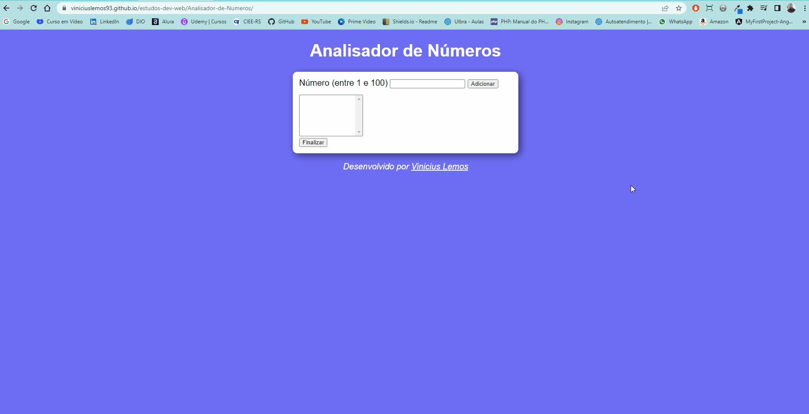

<h1 align="center">Projeto - Analisador de Números</h1>

Projeto de estudo, desenvolvido em HTML, CSS e JavaScript.

Desenvolvido durante o curso de JavaScript do Curso em Vídeo

<h1 align="center">Gif do Resultado</h1>

<h2 align="center">Tecnologias Usadas</h2>

     
 
        
        
              
    

Deploy: https://viniciuslemos93.github.io/estudos-dev-web/Analisador-de-Numeros/

- Libera para o usuário inserir apenas números de 1 a 100

Ao clicar em Finalizar, ele exibe:

- A quantidade de números inseridos
- O maior e o menor número que foi inserido
- A soma total
- A média dos valores
