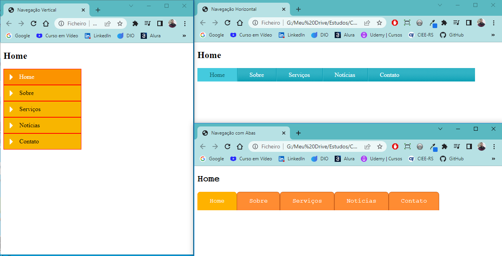

<h1 align="center">Barras de Navegações - Modelos</h1>

Desenvolvemos 3 modelos de menu de navegação, utilizando

- Usamos listas para criação dos Menus
- Com efeito Hover
- Ao clicar no ítem do menu, o mesmo fica selecionado

<h3> Estes 3 projetos foram desenvolvidos no dia 13/10/2022. </h3>

Deploy Barra de Navegação Horizontal: https://viniciuslemos93.github.io/estudos-dev-web/barra-navegacao-horizontal/
Deploy Barra de Navegação Lateral: https://viniciuslemos93.github.io/estudos-dev-web/barra-navegacao-lateral/
Deploy Navegação com Abas: https://viniciuslemos93.github.io/estudos-dev-web/navegacao-com-abas/

<h1 align="center">Print do Resultado</h1>

<h2 align="center">Tecnologias Usadas</h2>

     
 
        
        
    

