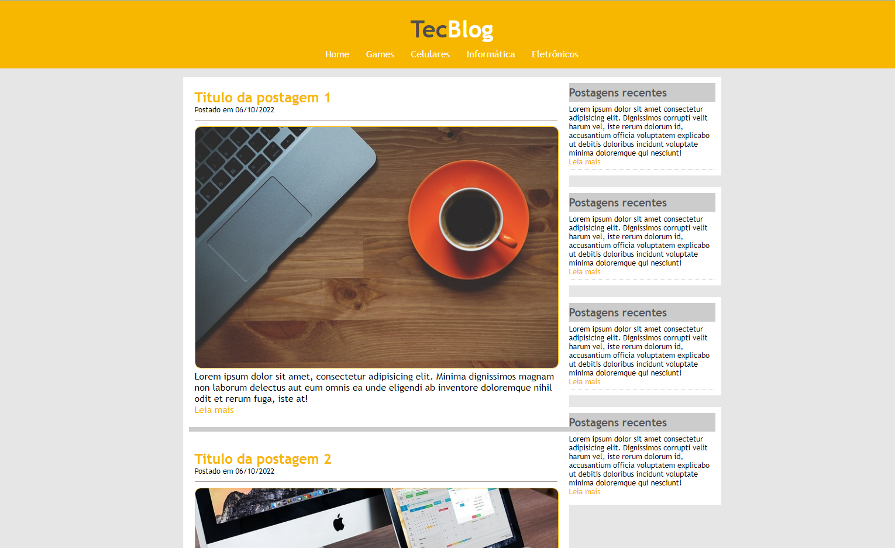

<h1 align="center">Projeto TecBlog</h1>

Projeto de estudo para criação de Web Site, desenvolvido em HTML e CSS.

Este foi o terceiro projeto desenvolvido durante o curso de Desenvolvimendo Web que estou realizando pela Udemy.

- Menu com animação no evento Hover
- Começamos a trabalhar com as DIVs e realizando seus posicionamentos na tela.

<h3> Projeto desenvolvido no dia 06/10/2022. </h3>

Deploy: https://viniciuslemos93.github.io/estudos-dev-web/Projeto-Tec_Blog/
<h1 align="center">Print do Resultado</h1>

<h2 align="center">Tecnologias Usadas</h2>

     
 
        
        
    

