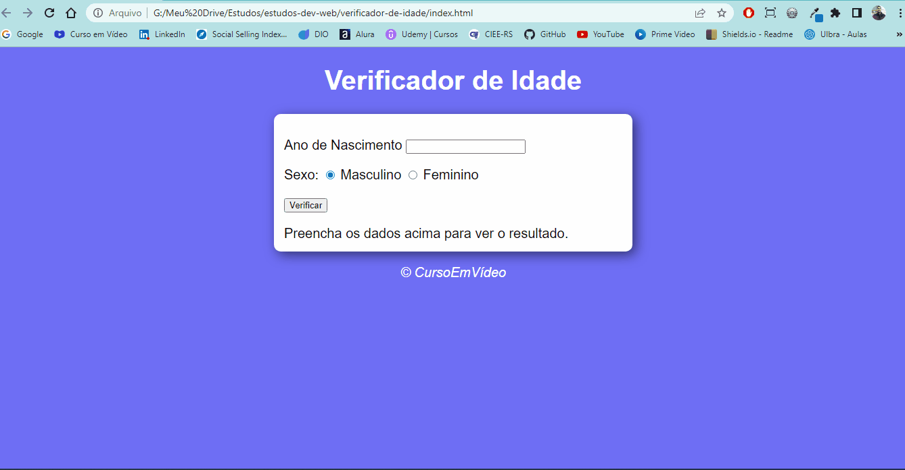

<h1 align="center">Projeto - Verificador de Idades</h1>

Projeto de estudo, desenvolvido em HTML, CSS e JavaScript.

Desenvolvido durante o curso de JavaScript do Curso em Vídeo

<h1 align="center">Gif do Resultado</h1>

<h2 align="center">Tecnologias Usadas</h2>

     
 
        
        
              
    

Deploy: https://viniciuslemos93.github.io/estudos-dev-web/verificador-de-idade/

- Possui um campo de texto para o usuário inserir a data de nascimento.
Se o cálculo do ano atual - ano de nascimento for:
- Até 10 - exibe criança.
- De 11 Até 20 - exibe jovem.
- De 21 Até 50 - exibe adulto(a).
- Senão, é acima de 50 - exibe idoso(a).
